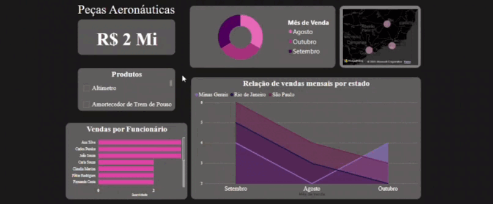

# Tecnologia da Informação - UFBRA

Professor Ronaldo Emerick - Administração - Dez/24

## Projeto para aprendizado - Dashboards utilizando PowerBI
Plataforma para visualização de dados que fornece insights para vendas de peças aeronáuticas. Permite filtrar por **funcionário**, **mês** e principalmente **produto**.

### Base de dados
Foi-se utilizado uma base de dados CSV, gerados por uma IA, e relacionados entre si. 

## Funcionamento 

